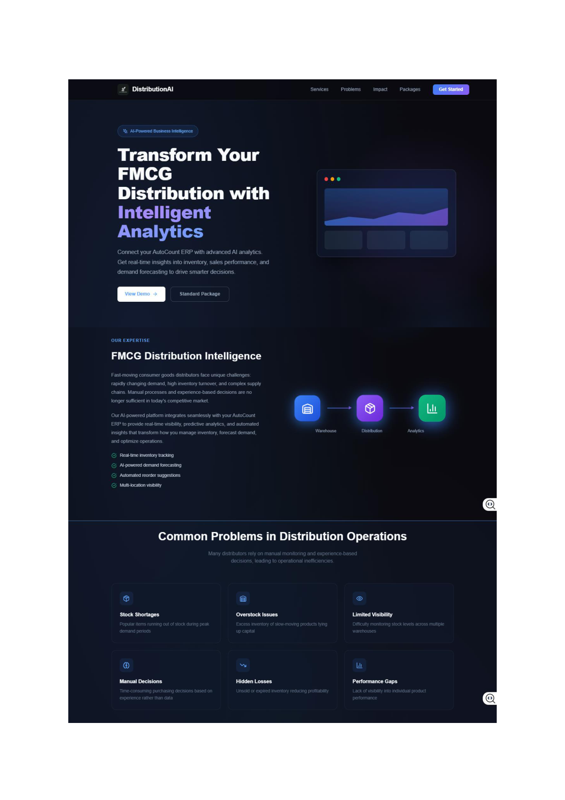
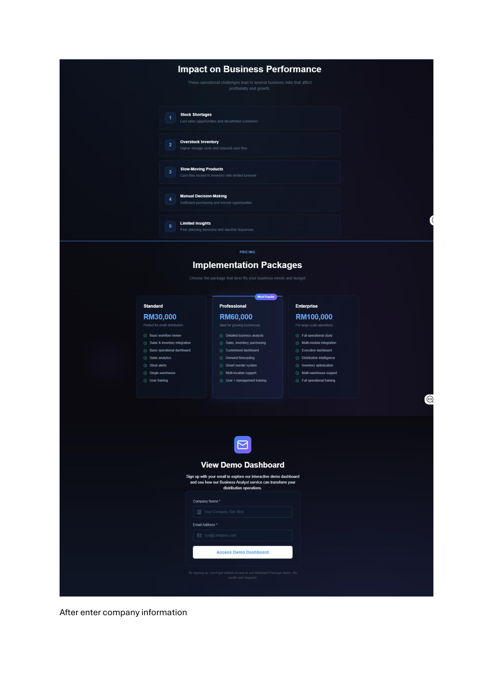
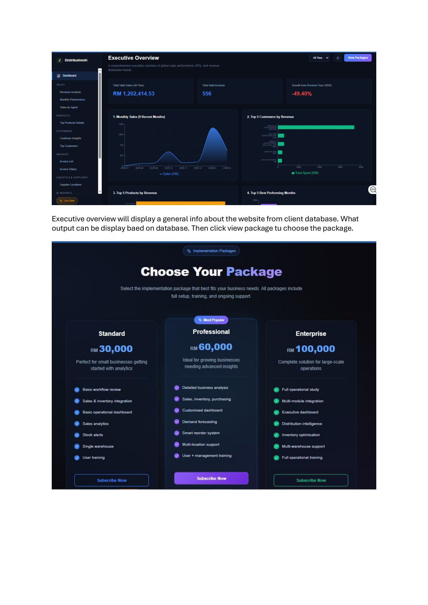

---

# 📊 AI-Smart FMCG Distribution Platform

## 📌 Project Overview

This project presents an enterprise-grade AI-powered FMCG distribution platform developed during my internship. The dashboard serves as a centralised command centre for real-time inventory monitoring, sales analytics, logistics tracking, and AI-driven business insights across multiple warehouse branches.

---

## 🎯 Business Objectives

- Centralise multi-branch warehouse operations and logistics tracking
- Provide real-time stock aging analysis and inventory intelligence
- Leverage AI to generate actionable insights and cash flow projections
- Reduce stock-out incidents through predictive inventory management
- Enhance executive decision-making with high-level KPI visualisations
- Monitor delivery performance and pending dispatch rates

---

## 📈 Dashboard Preview

<table>
<tr>
<td align="center">
<b>Executive Command Center</b>  

</td>

<td align="center">
<b>Inventory Intelligence</b>  

</td>
</tr>

<tr>
<td colspan="2" align="center">
 
<b>Logistics & Route Monitoring</b>  

</td>
</tr>
</table>

---

## ❓ Business Questions Addressed

- Which warehouse branches have the highest risk of stock aging?
- What is the projected cash flow based on real-time sales transactions?
- Are there any critical bottlenecks in the current logistics and pending dispatches?
- How does product movement vary across different FMCG categories?
- What are the AI-recommended actions to optimise warehouse storage?

---

## 💡 Key Features

- **Multi-Branch Synchronization:** Real-time data bridging across Enterprise, Professional, and Standard packages.
- **AI-Powered Recommendations:** Automated operational workflow recommendations.
- **Dynamic Logistics Tracking:** Inline monitoring for "Pending Dispatch" and "DO Issue Rate".
- **Advanced Drill-Down Diagnostics:** Instant identification of stock-out alerts and courier delays.
- **Stock Aging Mechanics:** Genuine database queries for real-world stock aging data retrieval.

---

## 🛠 Tools & Technologies

- **Frontend:** React, JavaScript (JSX), Vite, CSS
- **Backend:** Python, FastAPI / Flask
- **Database:** Relational Database (SQL) / Data Simulation
- **Architecture:** Client-Server, AI Integration
- **Version Control:** Git & GitHub

---

## 📂 Repository Contents

| Directory/File | Description |
|------|-------------|
| `frontend/` | React-based user interface components and styling |
| `backend/` | Python server, API endpoints, and data processing scripts |
| `start_website.bat` | One-click startup script for local development |
| `README.md` | Complete project documentation |

---

## 💼 Skills Demonstrated

- Full-Stack Web Development (React + Python)
- System Architecture Design
- API Integration & Backend Data Fetching
- Database Management & Query Optimisation
- Business Intelligence & Dashboard UI/UX Design
- Logistics & Supply Chain Analytics

---

## 📚 What I Learned

During this internship project, I transitioned from traditional data analytics to full-stack dashboard development. It strengthened my ability to handle real-world backend data logic, optimise frontend rendering performance, and structure enterprise-level software. I also learned to translate complex logistics and inventory data into an intuitive "C-Suite" command centre interface.

---

## 📄 Project Documentation

A full UI flow and wireframe design of the FMCG platform is available in the provided PDF:

📄 **[View UI Website FMCG PDF](../UI%20WEBSITE%20FMCG.pdf)**

---

## 👩 Author

**Nurdina Batrisyia**
