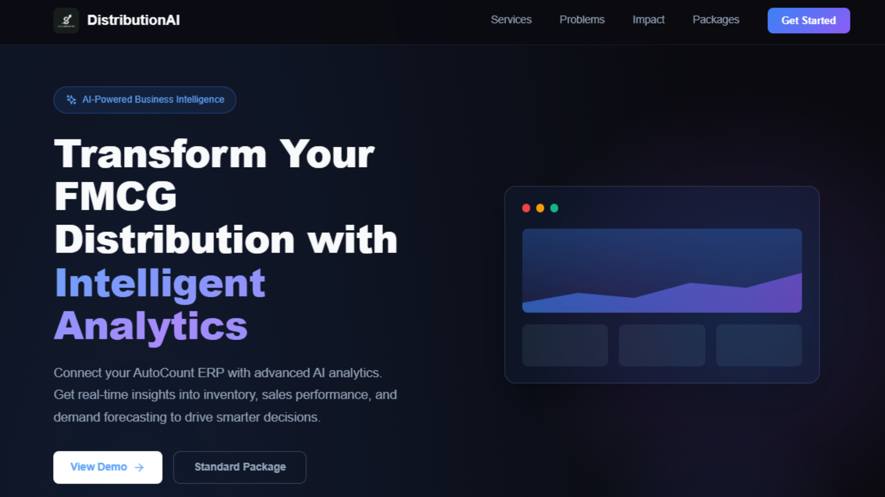
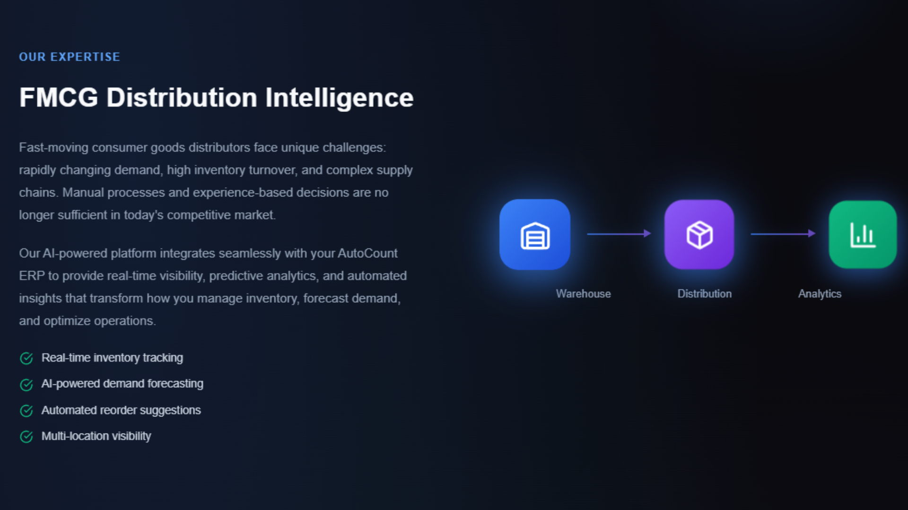
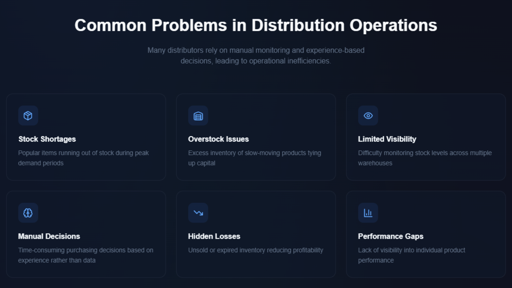
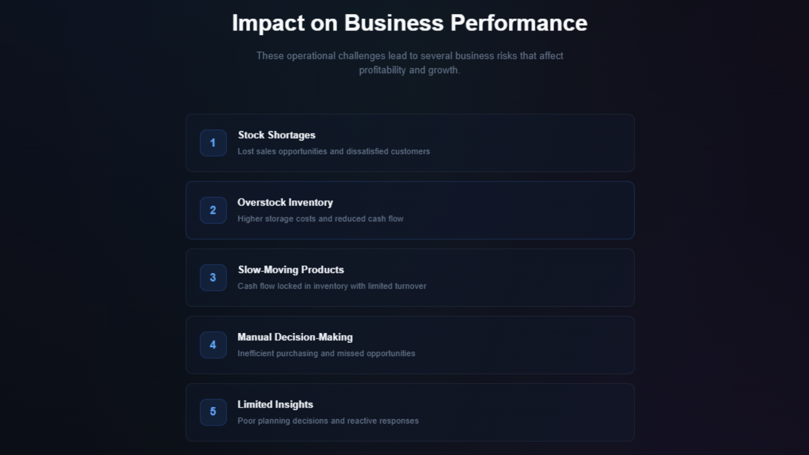
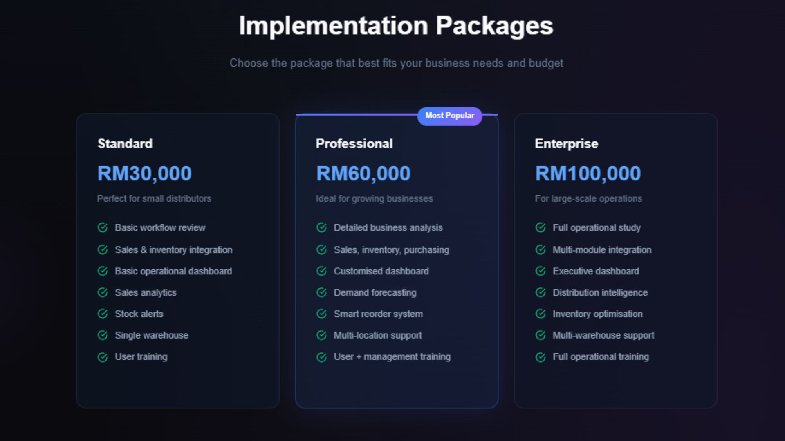
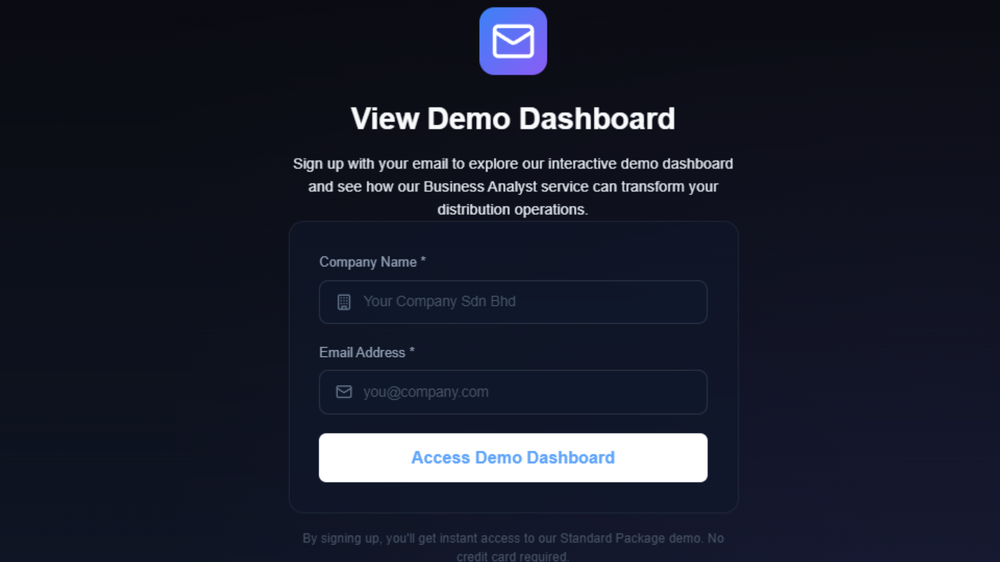
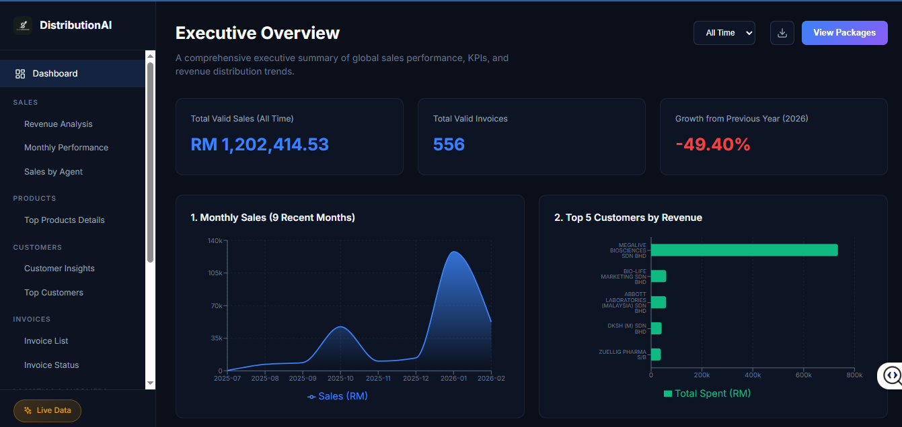
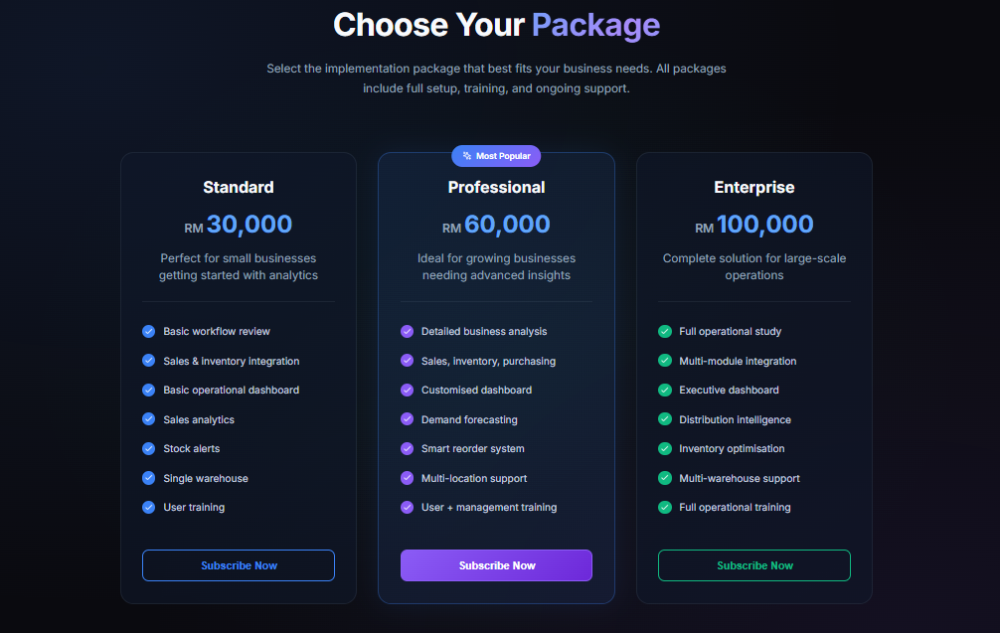

---

# 📊 AI-Smart FMCG Distribution Platform

## 📌 Project Overview

This project presents the **AI Smart Distribution System**, an intelligent distribution analytics platform designed specifically for FMCG (Fast-Moving Consumer Goods) distributors. Built to integrate seamlessly with existing ERP systems (such as AutoCount), it transforms raw operational data into actionable business intelligence. The system addresses critical industry challenges such as rapid demand changes, high inventory turnover, and the management of large product catalogues across multiple warehouses.

---

## 🎯 Business Objectives

- **Reduce Stock Shortages & Overstock:** Prevent popular items from running out during peak periods and minimize excess inventory that ties up capital.
- **Data-Driven Decision Making:** Replace manual, experience-based purchasing decisions with AI-driven demand forecasting and actionable insights.
- **Enhance Operational Visibility:** Provide real-time visibility into sales performance, stock levels, and multi-warehouse operations.
- **Improve Cash Flow & Profitability:** Identify slow-moving products to unlock locked capital and reduce hidden losses from unsold or expired inventory.
- **Sales & Revenue Optimization:** Measure salesperson and branch effectiveness, and support better pricing and discount controls.

---

## 📈 Platform UI & Features

### 1️⃣ Website Overview
*A high-level view of the main platform interface and navigation.*

   
   
   
   
   
  

  

### 2️⃣ Demo Dashboard
*Interactive demonstration of real-time data synchronization and live analytics.*

  

  
  

### 3️⃣ Package Offerings
*Comparison overview of the Standard, Professional, and Enterprise implementation tiers.*

  

  
  

---

## 📦 Package-Specific Features

### 🟢 Standard Package
*Ideal for small-to-medium businesses focusing on essential inventory tracking and basic sales analytics.*
- **Executive Sales Summary:** Monitor your fundamental KPIs, including Monthly Revenue trends and Top 5 Best-Selling Products in real-time.
- **Inventory Thresholds:** Get immediate visibility into 'Low Stock' items and essential warehouse statuses to prevent basic stockouts.
- **Customer Overview:** Track total active customers and average order values seamlessly for daily performance checks.

   
   
   
  

  

### 🔵 Professional Package
*Designed for growing businesses requiring multi-location support, demand forecasting, and deeper profit analysis.*
- **Interactive Profit Analysis:** Use dynamic sliders to adjust 'Target Goals' and 'Running Costs' to instantly project net profit margins.
- **Customer Intelligence Flashcards:** Identify 'Win Back' customers and 'Payment Follow-ups' with a single click to protect cash flow.
- **Multi-Branch Visibility:** Track inventory health and product movement across multiple warehouse locations simultaneously.

   
   
   
  

  

### 👑 Enterprise Package (Flagship)
*A comprehensive C-suite command center featuring AI-driven operations, risk simulation, and global warehouse intelligence.*
- **"What-If" Business Simulator:** Stress-test your business by dragging sliders for "Demand Surge" and "Supply Delay" to see the direct impact on your Corporate Health Score.
- **Branch Intelligence AI:** Automatically analyzes every branch to detect slow-moving stock or supply shortages, accompanied by immediate actionable recommendations.
- **Live Auto-Pilot Feed:** High-level monitoring where the AI system autonomously drafts Purchase Orders (POs) and reroutes surplus inventory between branches without human intervention.

   
   
   
  

  

---

## ❓ Business Questions Addressed

- **Branch Diagnostics:** Which specific warehouse branches are underperforming in sales despite having healthy stock levels, and require targeted promotions? 
- **Customer Retention & Recovery:** Which inactive customers fall into the "Win Back" category, and how much past revenue is at risk of being lost? 
- **Risk Simulation:** If supply is delayed by X days and demand surges by Y%, what is the projected impact on overall profit margins and the Business Health Score?
- **Credit & Cash Flow Control:** Which major clients have outstanding payments, and what is their specific credit term status? 
- **AI Automation:** What proactive actions (e.g., auto-drafting POs or rerouting surplus units) should be taken instantly to prevent critical branch stockouts? 

---

## 💡 Key Features

- **Sales Analytics:** Comprehensive business intelligence to identify top-performing products, profitable customers, and seasonal buying patterns.
- **Demand Forecasting (AI-Driven):** Predict future customer demand based on historical sales, market behavior, and seasonality to accurately plan purchasing and logistics.
- **Inventory Intelligence & Alerts:** Real-time inventory monitoring with automated low-stock notifications to prevent missed reorder opportunities.
- **Multi-Warehouse Monitoring:** Complete visibility across all distribution centres to track stock movement and optimize inventory positioning.
- **Executive Management Dashboards:** Visual insights, trend charts, and KPI summaries tailored for quick decision-making by management (supports Standard, Professional, and Enterprise packages).

---

## 🛠 Tools & Technologies

- **Frontend:** React, JavaScript (JSX), Vite, CSS
- **Backend:** Python, FastAPI / Flask
- **Database:** Relational Database (SQL) / Data Simulation
- **Architecture:** Client-Server, AI Integration
- **Version Control:** Git & GitHub

---

## 📂 Repository Contents

| Directory/File | Description |
|------|-------------|
| `frontend/` | React-based user interface components and styling |
| `backend/` | Python server, API endpoints, and data processing scripts |
| `start_website.bat` | One-click startup script for local development |
| `README.md` | Complete project documentation |

---

## 💼 Skills Demonstrated

- Full-Stack Web Development (React + Python)
- System Architecture Design
- API Integration & Backend Data Fetching
- Database Management & Query Optimisation
- Business Intelligence & Dashboard UI/UX Design
- Logistics & Supply Chain Analytics

---

## 📚 What I Learned

During this internship project, I transitioned from traditional data analytics to full-stack dashboard development. It strengthened my ability to handle real-world backend data logic, optimise frontend rendering performance, and structure enterprise-level software. I also learned to translate complex logistics and inventory data into an intuitive "C-Suite" command centre interface.

---

## 📄 Project Documentation

A full UI flow and wireframe design of the FMCG platform is available in the provided PDF:

📄 **[View UI Website FMCG PDF](../UI%20WEBSITE%20FMCG.pdf)**

---

## 👩 Author

**Nurdina Batrisyia**
